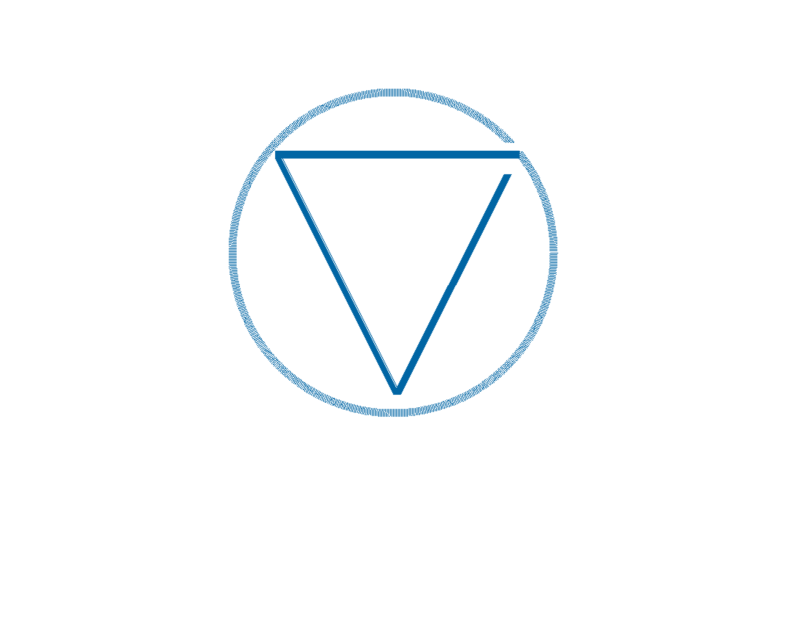

# 343-language-creation-flex-and-bison

For this project, you will be creating a new programming language.  This language will not be very complex (certainly not Turing complete!).  Since we recently learned that Microsoft Paint [is being retired](https://www.theguardian.com/technology/2017/jul/24/microsoft-paint-kill-off-after-32-years-graphics-editing-program "Microsoft Paint to be retired") people need a new way to create (incredibly) simple pictures.  Our language seeks to fill that gap!

We are going to call our language Zoomjoystrong (thank you to the [Product Name Generator](http://online-generator.com/name-generator/product-name-generator.php "Product Name Generator").  Zoomjoystrong will will be written in C, with the help of Flex and Bison.  As such, we will need the following pieces:

  - A Flex file to define our tokens.  We will call this ```zoomjoystrong.lex```.
  - A Bison file to define our grammar.  This will be called ```zoomjoystrong.y```.
  - A graphics library with functions we can call to do the drawing.  This will be provided to you in files called ```zoomjoystrong.h``` and ```zoomjoystrong.c```.

Note that you don't have to create the graphics library; it is provided in this repo.

## Project Specifications

**Flex File**

Your Flex file should define the following tokens:

  - END.  This statement exits the interpreter.
  - END_STATEMENT.  All commands should end with a semicolon.
  - POINT.  When we match the command to plot a point.
  - LINE.  When we match the command to draw a line.
  - CIRCLE.  When we match the command to draw a circle.
  - RECTANGLE.  When we match the command to draw a rectangle.
  - SET_COLOR.  Matches the command to change colors.
  - INT.  Matches an integer value.
  - FLOAT.  Matches a floating-point value.
  - A way to match tabs, spaces, or newlines, and to ignore them.
  - A way to match anything not listed above, and to tell the user they messed up.

**Bison File**

Your Bison file will define the grammar of the language.  We want to support:

  - A statement list of one or (arbitrarily) more statements followed by the END token.
  - Valid statements followed by the END_STATEMENT token.
  - A line command of the syntax ```line x y u v``` that will plot a line from x,y to u,v.
  - A point command of the syntax ```point x y``` that plots a single point at x,y.
  - A circle command with the syntax ```circle x y r``` that plots a circle of radius r around the center point at x, y.
  - A rectangle command with the syntax ```rectangle x y w h``` that draw a rectangle of height h and width w beginning at the top left edge x,y.
  - A set color statement with syntax ```set_color r g b``` that changes the current drawing color to the r,g,b tuple.

## Compiling

Bison will create the ```zoomjoystrong.tab.h``` and ```zoomjoystrong.tab.c``` files when you run the command ```bison -d zoomjoystrong.y```.  You will need to include the ```zoomjoystrong.tab.h``` file in your ```zoomjoystrong.lex``` file so that the lexer will return the correct tokens to the parser.

Flex will create the ```lex.yy.c``` lexer code when you run the command ```flex zoomjoystrong.lex```.

We then compile ```zoomjoystrong.c```, ```lex.yy.c```, and ```zoomjoystrong.tab.c``` into an executable called ```zjs``` with the command:

```C
gcc -o zjs zoomjoystrong.c lex.yy.c zoomjoystrong.tab.c -lSDL2 -lm
```

on the EOS system.  Please note that this graphics library will usually fail to draw if you are logged in remotely, meaning you either need to test in the EOS or Arch labs, or install SDL2 on your systems.

Needed files can be downloaded here:
[zoomjoystring.c](./assignments/zoomjoystrong.c "zoomjoystrong.c")
[zoomjoystring.h](./assignments/zoomjoystrong.h "zoomjoystrong.h")

## Rubric

| Criteria | 10 Points | Up to 9 Points | 0 Points |
|----------|----------|----------|----------|
| Compilation | Compiles with no errors or warnings | Compiles but with warnings | Doesn't compile |
| Style Guide | Perfectly adheres to style guide | Minor style guide mistakes | Fails to adhere to style guide |
| Follows Project Specifications | No requirements omitted, parses files correctly | 1 - 2 requirements omitted | More than 2 requirements omitted |
| Error handling | Gracefully handles user errors (i.e. if they type a command incorrectly we let them know instead of crashing with no message).  Additionally, we need to make sure the numbers are in valid ranges; colors values should be in the range 0-255, points plotted should be between 0-width or height of our screen, etc. | Handles at least one type of error gracefully | Does not include error handling |
| On time | Submitted before due date and time | Submitted up to 1 day late | Submitted more than 1 day late |

### Sample files

Included in this repository are a sample Flex and sample Bison file for a calculator program.  These should be sufficient to help you get started, but you will likely need to read documentation online.

Additionally, I have created a sample program for you.  If you run the command ```zjs < sample_program.zjs``` you should see output like the following:



## Submission

Submit either a github link (preferred), or a zipped project directory to Blackboard.  Due date 3/12 at 8:00 a.m.
